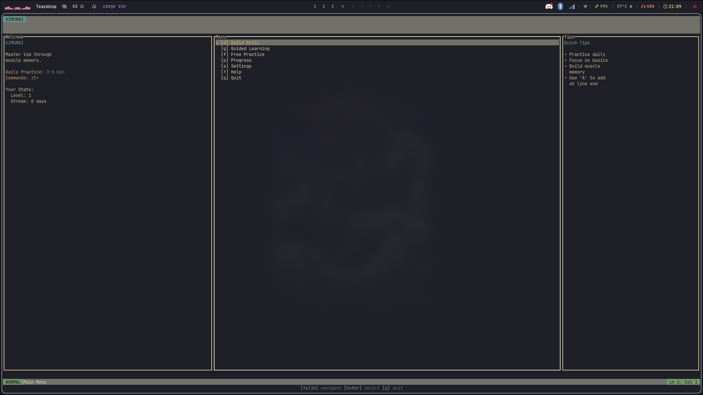
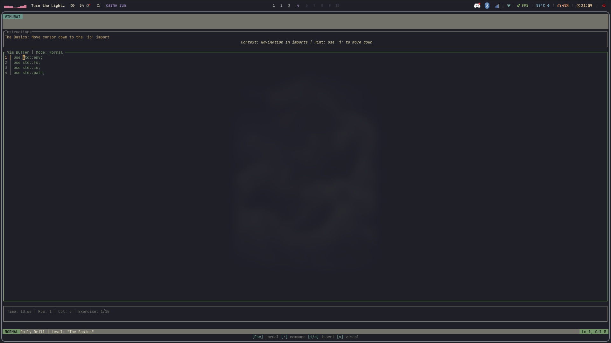
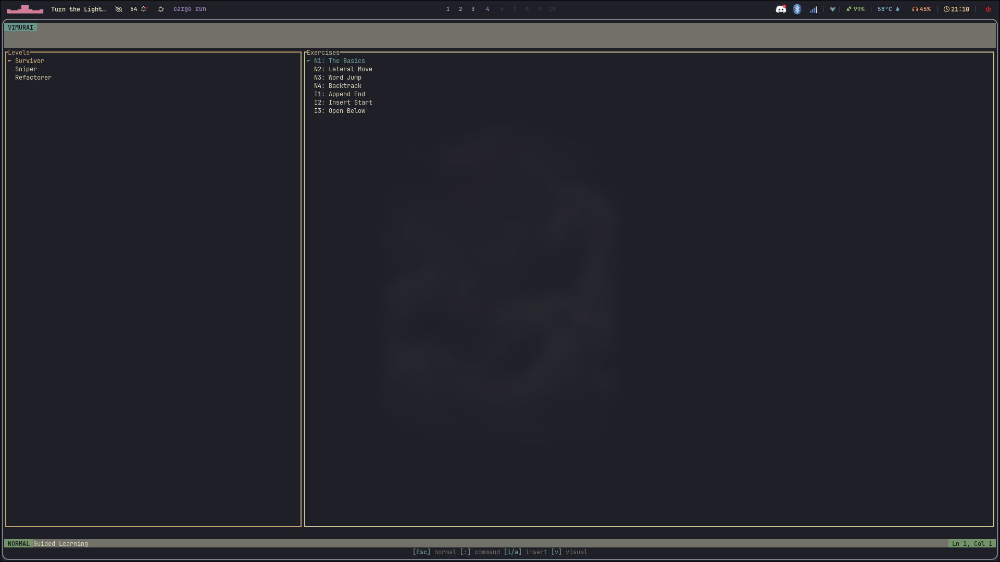

# Vimurai ⚔️

> **Master Vim through muscle memory.**
> An interactive CLI dojo that combines gamification with spaced repetition to forge your editing skills.


<p align="center">
  
  <br>
</p>

## 📸 Screenshots

<p align="center">
  
  
  
</p>

## ✨ Features

- **🧠 Smart Learning Engine:** Uses the **SM-2 Spaced Repetition** algorithm to schedule reviews based on your performance.
- **🗺️ Guided Curriculum:** A structured path from "Survivor" (Basics) to "Wizard" (Macros), organized by Belts.
- **🎮 Gamified Progression:** Earn XP, level up, and maintain your daily streak.
- **⚡ Real Vim Engine:** Supports operators (`d`, `c`, `y`), motions (`w`, `f`, `t`), and visual mode.
- **🖥️ Professional TUI:** Built with `ratatui` for a beautiful, responsive terminal interface.

## 🚀 Installation

### Prerequisites

- [Rust](https://www.rust-lang.org/tools/install) (1.70+)

### Build from Source

```bash
git clone https://github.com/stiffis/vimurai.git
cd vimurai
cargo install --path .
```

## 🕹️ Usage

Run the application:

```bash
vimurai
```

### Game Modes

1.  **Daily Drill:** Your personalized daily workout. Focuses on what you're about to forget.
2.  **Guided Learning:** Browse the library of techniques and practice specific skills at your own pace.
3.  **Free Practice:** A sandbox buffer to experiment freely.

### Controls

- **Navigation:** `j` / `k` (or arrows) to move in menus.
- **Select:** `Enter`.
- **Back/Quit:** `Esc` or `q`.
- **In-Game:** Use Vim keys! (`:q` to exit practice).

## 🥋 Curriculum (The Path)

| Rank |       Belt        | Focus            | Skills                            |
| :--: | :---------------: | :--------------- | :-------------------------------- |
|  1   |  ⬜ **Survivor**  | Basic Navigation | `h` `j` `k` `l` `w` `b` `i` `a`   |
|  2   |   🟨 **Sniper**   | Precision        | `f` `t` `^` `$` `0`               |
|  3   | 🟧 **Refactorer** | Grammar          | `cw` `dw` `cc` `dd` `c$`          |
|  4   |  🟩 **Surgeon**   | Text Objects     | `ci"` `di(` `yiw` _(Coming Soon)_ |
|  5   | 🟦 **Architect**  | Search & File    | `/` `?` `gg` `G`                  |
|  6   |   🟪 **Wizard**   | Automation       | `q` `@` Registers                 |

## 🛠️ Architecture

- **Engine:** Custom Vim-buffer implementation supporting undo/redo and operator-pending states.
- **Persistence:** SQLite database (`progress.db`) stores user stats and scheduling data.
- **UI:** Rendered via `ratatui` with support for modals, gutters, and colored status lines.

## 🤝 Contributing

Contributions are welcome! Please feel free to submit a Pull Request.

1.  Fork the project
2.  Create your feature branch (`git checkout -b feature/AmazingFeature`)
3.  Commit your changes (`git commit -m 'Add some AmazingFeature'`)
4.  Push to the branch (`git push origin feature/AmazingFeature`)
5.  Open a Pull Request

## 📄 License

Distributed under the GNU General Public License v2.0. See `LICENSE` for more information.
