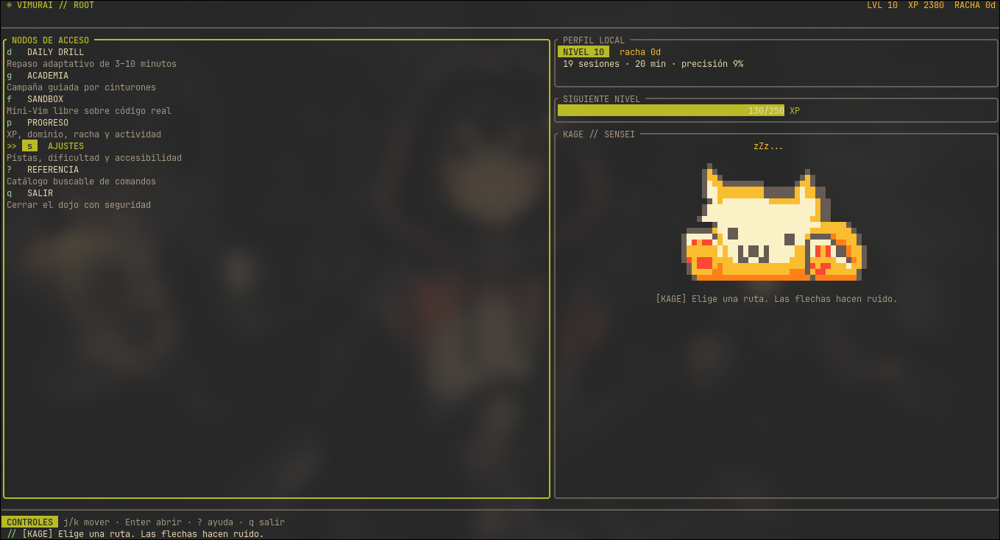
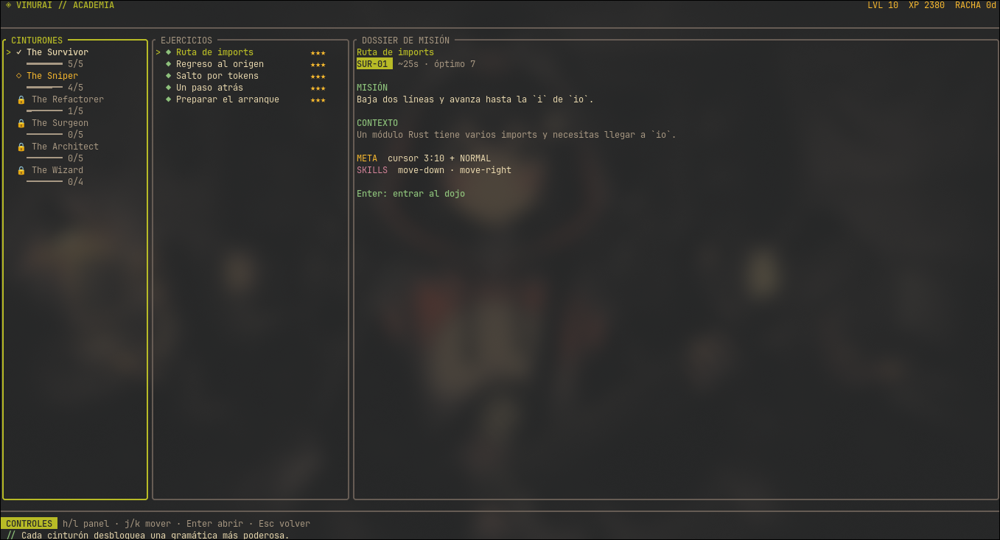
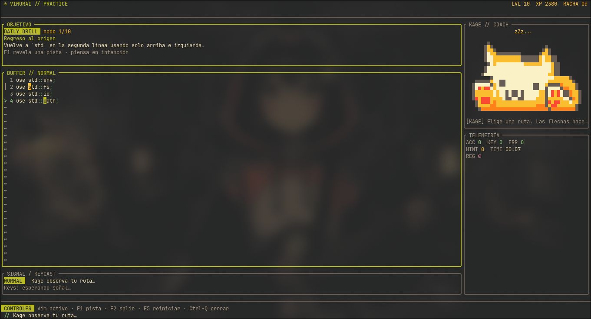

# VIMURAI

> Master Vim through muscle memory.

Vimurai is an interactive terminal dojo built in Rust with Ratatui. It combines
a mini Vim editor, realistic coding challenges, a belt-based academy, SM-2
spaced repetition, and lightweight gamification. Kage, a hacker cat drawn in
terminal pixel art, accompanies each session and reacts to how you solve each
exercise.

The interface and lesson content are currently in Spanish.

## Features

- **Daily Drill:** a finite review session tailored to the skills that are due
  for practice.
- **Academy:** a progressive path from `hjkl` to operator grammar, text objects,
  search, and structural navigation, with 29 missions across six belts.
- **Sandbox:** a free practice buffer with sample snippets that lets you
  experiment without risking your progress.
- **Unicode mini Vim:** Normal, Insert, Visual, Command, and Search modes;
  counts, motions, operators, registers, undo/redo, and searches.
- **Local progress:** XP, level, streak, accuracy, activity, per-command mastery,
  and achievements stored in SQLite.
- **Responsive TUI:** wide and compact layouts, automatic Gruvbox Dark/Light,
  an inherited terminal background, high contrast, and terminal restoration
  on errors.

The learning philosophy and product decisions are documented in
[the project vision](docs/VISION.md).

## Screenshots

### Home

Choose a practice mode, check your local profile, and meet Kage.



### Academy

Explore the six belts, review your completed exercises, and read each mission's
objective before entering the dojo.



### Daily Drill

Practice Vim motions in a focused editor with an exercise objective, contextual
coaching, and live session metrics.



## Getting started

Requirements: Rust 1.88 or newer and a Unicode-capable terminal. `NO_COLOR=1`
uses the terminal's default colors throughout the interface. `--ascii`
replaces Kage's pixel art with a simple ASCII cat.

From the repository root:

```bash
cargo run --release
```

To install the binary in your Cargo bin directory:

```bash
cargo install --path .
vimurai
```

### Terminal theme

Vimurai inherits your terminal's background, transparency, and wallpaper. At
startup, it queries the default background color using OSC 11 and selects
**Gruvbox Dark** or **Gruvbox Light** based on its luminance. The query waits
up to 50 ms and preserves any keys received during that interval. Late terminal
responses are consumed safely without being interpreted as keyboard input.

If the terminal does not respond, Vimurai checks `TERM_BACKGROUND`,
`TERMINAL_THEME`, and then `COLORFGBG`. The final fallback is Gruvbox Dark.
You can force a variant or disable the query without changing your progress:

```bash
VIMURAI_THEME=light vimurai   # also accepts dark; takes priority over detection
VIMURAI_NO_OSC=1 vimurai      # use environment hints only
```

Detection runs on every launch. After switching your terminal between light
and dark profiles, reopen Vimurai to select the matching palette.

## Controls

Outside the editor:

| Key | Action |
|---|---|
| `j` / `k` or arrow keys | Move the selection |
| `h` / `l` | Switch panels |
| `Enter` | Open / confirm |
| `Esc` | Go back / close an overlay |
| `F1` | Contextual help |
| `q` | Request to quit |

During practice, printable keys are reserved for Vim. Application shortcuts
use separate keys so they do not interfere with motions:

| Key | Action |
|---|---|
| `F1` | Show a contextual hint |
| `F2` | Leave practice / return to the map |
| `F3` | Pause the session and view progress |
| `F5` | Restart the challenge (records the attempt) |
| `F6` | Switch snippets in Sandbox |
| `Ctrl-Q` | Request to quit Vimurai |
| `:q` | Leave the buffer as in Vim |

Bracketed paste is supported only in Sandbox: a copied solution cannot award
XP or alter spaced repetition.

## Data and privacy

Vimurai works without accounts or network access. Progress is stored in the
operating system's local data directory, typically on Linux:

```text
~/.local/share/vimurai/progress.db
```

Set `VIMURAI_DATA_DIR` to use another directory. This also makes it easy to keep
portable profiles and isolate test data.

Prototype databases are migrated transactionally. Records with safe
equivalents are mapped to the current curriculum; the remaining legacy
exercise records are archived in the same SQLite database. Migration does not
assign mastery to motions that have not been practiced.

## Development

```bash
cargo fmt --all -- --check
cargo clippy --all-targets --all-features -- -D warnings
cargo test --all-targets --all-features
cargo doc --no-deps
```

The editor is independent of Ratatui, the curriculum is declarative, and
persistence tests use SQLite `:memory:` databases or temporary database files.
Terminal cleanup uses RAII and a panic hook to restore raw mode, the alternate
screen, the cursor, and bracketed paste, including on panic paths.

## License

[GPL-2.0-only](LICENSE), continuing the original Vimurai project's license.
